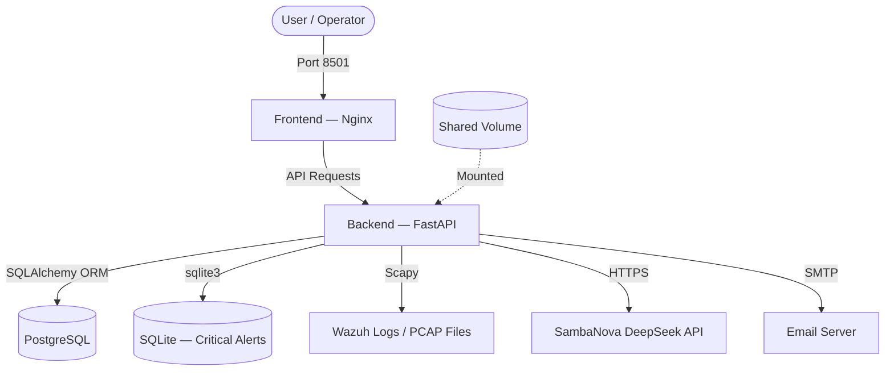

# 🛡️ BLACK WALL — Technical Documentation & Architecture

This document provides a comprehensive analysis of the **BLACK WALL** project, a pedagogical IDS/SIEM dashboard following professional software engineering standards.

---

## 🏗️ System Architecture

BLACK WALL uses a containerized microservices architecture with a **layered backend**.



### Services Overview

| Service | Container | Image | Port | Role |
|---------|-----------|-------|------|------|
| **db** | `blackwall-db` | `postgres:16-alpine` | 5432 | Alert history |
| **backend** | `blackwall-backend` | Custom Python 3.11 | 8000 | Detection engine + API |
| **frontend** | `blackwall-frontend` | `nginx:alpine` | 8501→80 | SIEM dashboard |

---

## 🧱 Backend Architecture (Layered)

The backend follows **separation of concerns** with a clear layered architecture:

```
Controllers → Services → Repositories → Database
    (HTTP)    (Logic)      (DAO)         (PG/SQLite)
```

### Layer Responsibilities

| Layer | Package | Purpose |
|-------|---------|---------|
| **Config** | `app/config/` | Centralized env var loading — single source of truth |
| **Models** | `app/models/` | SQLAlchemy entities + Pydantic schemas |
| **Repositories** | `app/repositories/` | DAO pattern — database abstraction |
| **Services** | `app/services/` | Business logic (detection, AI, email, pipeline) |
| **Controllers** | `app/controllers/` | FastAPI Routers — HTTP endpoints |
| **Workers** | `app/workers/` | Background threads (file watcher) |
| **Utils** | `app/utils/` | Shared helpers (parsers, classifiers, catalog) |

### DAO Pattern (Database Abstraction)

```python
# repositories/base.py — Abstract interface
class AlertRepository(ABC):
    def init_db(self) -> None: ...
    def save_detections(self, detections: list[dict]) -> int: ...
    def get_alert_history(self, limit: int) -> list[dict]: ...
    def get_stats(self) -> dict: ...

# To add MySQL: create MySQLRepository(AlertRepository)
# Zero changes to services or controllers needed.
```

---

## 🛠️ Technology Stack

### Backend (Python Ecosystem)
* **FastAPI:** High-performance web framework
* **Scapy:** Packet manipulation library for PCAP analysis
* **SQLAlchemy:** ORM for PostgreSQL
* **Requests:** HTTP client for SambaNova AI API
* **Uvicorn:** ASGI server

### Frontend (Modern Web)
* **HTML5/CSS3/JS:** Static files served by Nginx
* **TailwindCSS:** Utility-first CSS framework (CDN)
* **Chart.js:** Interactive security visualizations
* **Lucide:** Icon library

### Infrastructure
* **Docker + Docker Compose:** Multi-container orchestration
* **Nginx:** Static file server
* **PostgreSQL 16:** Primary database
* **SQLite 3:** Lightweight critical alert storage

---

## 🔍 Detection Mechanisms

| # | Method | Engine | Description |
|---|--------|--------|-------------|
| 1 | **Static Rules** | `detection_service.py` | Wazuh alert level ≥ threshold (default 8) |
| 2 | **ML Simulation** | `detection_service.py` | Simulated Decision Tree confidence score |
| 3 | **Port Scan** | `pcap_service.py` | IP → ≥ 10 unique ports on same target |
| 4 | **DoS/Flood** | `pcap_service.py` | > 100 packets/sec from single IP |
| 5 | **AI Analysis** | `ai_service.py` | SambaNova DeepSeek threat analysis |

### Alert Pipeline (Critical Alerts)

```
Raw Alert → parse_alert() → dedup(SHA-256) → analyze_with_ai() → save_to_sqlite() → send_email()
```

---

## 🚀 Key Features

* **Risk Scoring:** 0-100 score combining rule level, ML confidence, and attack patterns
* **Pedagogical Summaries:** Plain-language explanations in French
* **Dual Database:** PostgreSQL for history + SQLite for critical real-time alerts
* **AI Integration:** SambaNova DeepSeek for natural language threat analysis
* **Email Alerts:** Rate-limited SMTP notifications with HTML formatting
* **CSV/JSON/PCAP:** Multi-format log ingestion
* **Real-time Monitoring:** Daemon thread tailing Wazuh alerts.json
* **Live Webhook:** Real-time Wazuh → Backend webhook for instant alert ingestion

---

## 🔗 Wazuh Live Integration (Webhook Pipeline)

### Current Architecture (HIDS — Host-Based)

Currently, BLACK WALL operates as a **HIDS/SIEM** (Host-based Intrusion Detection System). Wazuh monitors system logs (SSH, authentication, file integrity) and forwards alerts to BLACK WALL via webhook.

```
┌─────────────────────────────────────────────────────────────────────────┐
│                        AWS EC2 Instance                                │
│                                                                        │
│  ┌──────────────────┐         ┌──────────────────────────────────────┐  │
│  │  Wazuh (Docker)  │         │  BLACK WALL (Docker Compose)         │  │
│  │                  │         │                                      │  │
│  │  ┌────────────┐  │  HTTP   │  ┌──────────┐    ┌──────────────┐   │  │
│  │  │  Manager   │──┼────────►│  │ Backend  │    │   Frontend   │   │  │
│  │  │integratord │  │  POST   │  │ FastAPI  │    │    Nginx     │   │  │
│  │  │            │  │ :8000   │  │  :8000   │    │    :8501     │   │  │
│  │  └────────────┘  │         │  └────┬─────┘    └──────────────┘   │  │
│  │                  │         │       │                              │  │
│  │  ┌────────────┐  │         │  ┌────▼─────┐    ┌──────────────┐   │  │
│  │  │   Agent    │  │         │  │PostgreSQL│    │    SQLite     │   │  │
│  │  │ (on host)  │  │         │  │ (history)│    │  (critical)  │   │  │
│  │  └────────────┘  │         │  └──────────┘    └──────────────┘   │  │
│  └──────────────────┘         └──────────────────────────────────────┘  │
└─────────────────────────────────────────────────────────────────────────┘
```

**Capabilities (current) :**
- ✅ Détection des attaques par brute force SSH
- ✅ Surveillance de l'intégrité des fichiers (FIM)
- ✅ Détection des escalades de privilèges
- ✅ Analyse des logs système (syslog, auth.log)
- ❌ Analyse du trafic réseau en temps réel (pas de NIDS)

---

### Architecture Future (HIDS + NIDS — avec Suricata)

En ajoutant **Suricata**, le système devient un **IDS hybride** combinant l'analyse des logs système (HIDS) et l'analyse du trafic réseau (NIDS).

```
┌─────────────────────────────────────────────────────────────────────────┐
│                        AWS EC2 Instance                                │
│                                                                        │
│  ┌──────────────────────────────────────────────────┐                   │
│  │           Machine Surveillée (Agent VM)           │                   │
│  │                                                   │                   │
│  │  ┌──────────────┐     ┌───────────────────────┐  │                   │
│  │  │   Suricata   │     │     Wazuh Agent       │  │                   │
│  │  │   (NIDS)     │     │                       │  │                   │
│  │  │              │     │  Lit les logs de :     │  │                   │
│  │  │  Écoute le   │────►│  • Suricata (eve.json)│  │                   │
│  │  │  trafic sur  │     │  • SSH / auth.log     │  │                   │
│  │  │  eth0        │     │  • Fichiers système   │  │                   │
│  │  │              │     │                       │  │                   │
│  │  │  Écrit dans  │     │  Envoie tout au       │  │                   │
│  │  │  eve.json    │     │  Manager (port 1514)  │  │                   │
│  │  └──────────────┘     └───────────┬───────────┘  │                   │
│  └───────────────────────────────────┼──────────────┘                   │
│                                      │ TCP 1514                        │
│  ┌───────────────────────────────────▼──────────────┐                   │
│  │           Wazuh Manager (Docker)                  │                   │
│  │                                                   │                   │
│  │  alerts.json → integratord → custom-blackwall     │                   │
│  └───────────────────────┬───────────────────────────┘                   │
│                          │ HTTP POST :8000/webhook                      │
│  ┌───────────────────────▼──────────────────────────┐                   │
│  │           BLACK WALL (Docker Compose)              │                   │
│  │                                                   │                   │
│  │  Backend (FastAPI) → PostgreSQL + SQLite           │                   │
│  │  Frontend (Nginx)  → Dashboard SIEM               │                   │
│  └───────────────────────────────────────────────────┘                   │
└─────────────────────────────────────────────────────────────────────────┘
```

**Capabilities (with Suricata) :**
- ✅ Tout ce que le HIDS fait actuellement
- ✅ **Détection de port scans** en temps réel (Nmap, Masscan)
- ✅ **Détection d'attaques DDoS/DoS** (SYN flood, UDP flood)
- ✅ **Détection de malware** via signatures réseau (ET Open rules)
- ✅ **Inspection du trafic HTTP/TLS** (SQL injection, XSS)
- ✅ **Détection d'exfiltration de données** (DNS tunneling)

### Chaîne de détection complète (Suricata → BLACK WALL)

```
Trafic Réseau (eth0)
    │
    ▼
┌─────────────────────────────────────────────┐
│  1. SURICATA (Moteur NIDS)                  │
│     • Analyse les paquets en temps réel     │
│     • Compare contre 30,000+ signatures     │
│     • Écrit les alertes → eve.json          │
└──────────────────┬──────────────────────────┘
                   │ /var/log/suricata/eve.json
                   ▼
┌─────────────────────────────────────────────┐
│  2. WAZUH AGENT (Collecteur)                │
│     • Lit eve.json (config <localfile>)     │
│     • Decode les événements Suricata        │
│     • Transmet au Manager (TCP 1514)        │
└──────────────────┬──────────────────────────┘
                   │
                   ▼
┌─────────────────────────────────────────────┐
│  3. WAZUH MANAGER (Corrélation)             │
│     • Applique les règles de corrélation    │
│     • Attribue un niveau (1-15)             │
│     • Si level ≥ 8 → integratord            │
│       → custom-blackwall script             │
│       → curl POST au webhook                │
└──────────────────┬──────────────────────────┘
                   │ HTTP POST /webhook
                   ▼
┌─────────────────────────────────────────────┐
│  4. BLACK WALL BACKEND (Analyse)            │
│     • Pipeline 1: Level 8+ → PostgreSQL     │
│       → Dashboard (graphiques, logs)        │
│     • Pipeline 2: Level 12+ → IA + Email    │
│       → SambaNova DeepSeek analysis         │
│       → SMTP notification                   │
└─────────────────────────────────────────────┘
```

### Configuration Suricata (sur la machine Agent)

**1. Installation de Suricata :**
```bash
sudo apt-get update
sudo apt-get install suricata -y
sudo suricata-update   # Télécharge les règles ET Open
```

**2. Configuration de l'écoute réseau** (`/etc/suricata/suricata.yaml`) :
```yaml
af-packet:
  - interface: eth0    # Adaptez à votre interface réseau
```

**3. Démarrage de Suricata :**
```bash
sudo systemctl enable suricata
sudo systemctl start suricata
```

**4. Configuration de l'Agent Wazuh** (pour lire les logs Suricata) :
Ajoutez ce bloc dans `/var/ossec/etc/ossec.conf` de l'**Agent** :
```xml
<localfile>
    <log_format>json</log_format>
    <location>/var/log/suricata/eve.json</location>
</localfile>
```

Puis redémarrez l'agent : `sudo systemctl restart wazuh-agent`

> **Note :** Aucune modification du code Python de BLACK WALL n'est nécessaire.
> Wazuh traite les événements Suricata avec ses règles intégrées (rule group `suricata`)
> et les envoie au webhook comme n'importe quelle autre alerte.

---

## 🔧 Integration Components

| Component | Location | Purpose |
|-----------|----------|---------|
| `custom-blackwall` | `/var/ossec/integrations/` | Shell script that POSTs alert JSON to the webhook |
| `ossec.conf` | `/var/ossec/etc/ossec.conf` | `<integration>` block defining hook URL and alert level |
| `wazuh-integratord` | Wazuh Manager process | Daemon that reads alerts and calls the integration script |
| `/webhook` endpoint | `monitor_controller.py` | FastAPI route that receives and processes the alert |
| `suricata` | Agent machine | NIDS engine analyzing raw network packets (optional) |

---

## 📊 Dual Alert Pipeline

The webhook endpoint processes alerts through **two parallel pipelines**:

```
POST /webhook (raw Wazuh alert JSON)
    │
    ├─► Pipeline 1: Dashboard (ALL alerts level ≥ 8)
    │   └─► analyze_alerts() → detect_static() + detect_ml()
    │       └─► postgres_repo.save_detections() → PostgreSQL
    │           └─► Visible on dashboard (charts, logs, metrics)
    │
    └─► Pipeline 2: Critical (ONLY alerts level ≥ 12)
        └─► parse_alert() → dedup(SHA-256) → analyze_with_ai()
            └─► sqlite_repo.save_critical_alert() → SQLite
                └─► send_alert_email() → SMTP notification
```

### Configuration Settings

| Setting | File | Default | Controls |
|---------|------|---------|----------|
| `<level>` | `ossec.conf` | `8` | Minimum level Wazuh forwards to webhook |
| `STATIC_THRESHOLD_ALERT_LEVEL` | `.env` | `8` | Minimum level for dashboard display |
| `ALERT_MIN_LEVEL` | `.env` | `8` | Backend ingestion filter |
| `CRITICAL_ALERT_LEVEL` | `.env` | `12` | Threshold for AI analysis + email |

---

## 🌐 Frontend Data Flow

The SIEM dashboard (`dashboard.html`) connects to the backend API:

```javascript
// Dynamic backend URL (auto-detects server hostname)
const BackendUrl = `${window.location.protocol}//${window.location.hostname}:8000`;
```

### Auto-refresh Cycle

1. **On page load** → `loadInitialData()` fetches `/history` + `/stats`
2. **Every 30 seconds** → Auto-polls for new data (unless paused)
3. **Manual upload** → User uploads `.json` / `.pcap` → `POST /analyze`

---

*BLACK WALL IDS — Technical Documentation — PFA 2026*
